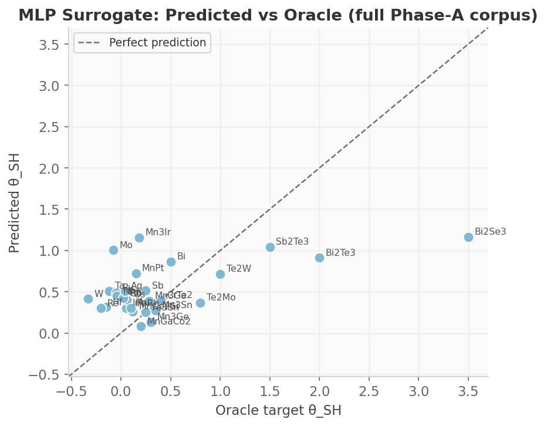
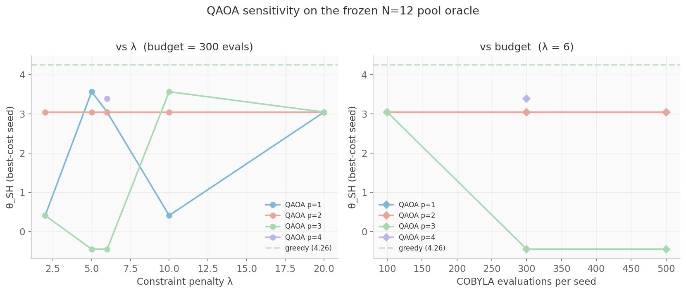
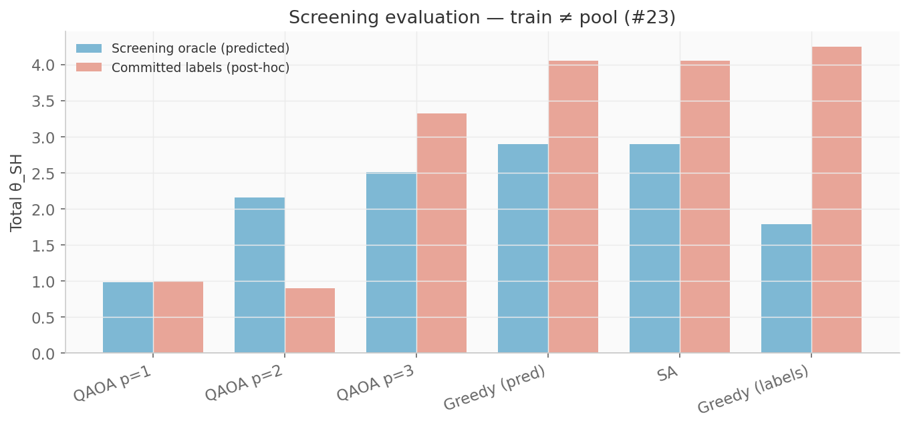

# spinq-vqe — Research Overview

**Variational Quantum Simulation of Antiferromagnetic Hamiltonians**

Part of [ARPA Quantum Logical Systems — QONDRA](https://github.com/arpaqls) · [qondra@arpacorp.net](mailto:qondra@arpacorp.net)

---

## What this is

In May 2026, the University of Tokyo (Nakatsuji Lab) demonstrated **40-picosecond spin-orbit torque switching** in **Mn₃Sn / tantalum heterostructures** — a Kagome antiferromagnet whose switching is rooted in spin–orbit coupling (SOC).

We cannot fabricate this material in silico, but we *can* simulate its quantum many-body physics using **Variational Quantum Eigensolvers (VQE)** and **Quantum Approximate Optimization Algorithms (QAOA)** on a classical simulator — and compare results directly to exact diagonalization and spectroscopic benchmarks.

`spinq-vqe` is the open-source Python package that implements this pipeline: lattice construction, variational ansätze, VQE runners, entanglement analysis, TeNPy DMRG references, NetKet Neural Quantum State baselines, an MLP surrogate for spin Hall angle, and a QAOA material-selection optimizer. All seven research notebooks are executed with published figures and reference data.

---

## Research threads

### Kagome lattice VQE

We simulate the Heisenberg antiferromagnet on a **1D Kagome strip** (the geometry used in the notebooks):

```
H = J Σ_{<i,j>} S_i · S_j  +  D Σ_i (S_i^z)²  +  B Σ_i S_i^z
```

The pipeline builds the lattice graph (NetworkX), maps spin operators to Pauli strings (PennyLane), and runs VQE with **COBYLA** (primary) or **Adam** (diagnostic). Results are benchmarked against sparse exact diagonalization.

**Decisions made in this release:** HEA depth = 3 for N = 9; COBYLA over Adam (zero gradients from the `|0⟩⊗N` initial state); system sizes N = 9, 12, 18, and 24 with DMRG as the primary classical reference beyond sparse ED.

### SOC material screening via QAOA

The spin Hall angle (θ_SH) is the figure of merit for spin-orbit torque efficiency. Selecting the top-k materials from N candidates is a combinatorial optimization problem, solved here with **QAOA** using a classical **MLP surrogate** as the oracle (Phase-A corpus: **32** materials in `data/mp_theta_sh.csv`; optional refresh via Materials Project API).

Materials Project supplies the structure metadata, while the θ_SH targets are a fixed illustrative oracle (`illustrative_oracle` in `data/mp_theta_sh.csv`). NB04 reports **train / CV / hold-out** surrogate metrics on the Phase-A corpus and runs QAOA / greedy / SA on a **fixed historical N=12 pool** with `oracle=in_sample` (pool LOOCV RMSE reported for honesty) — a reproducibility and method-demonstration workflow, not a materials-discovery claim.

**Decisions made in this release:** classical surrogate oracle (not raw DFT per evaluation); QAOA depths p = 1, 2, 3 compared against greedy and simulated-annealing baselines; k = 3 selected from N = 12 pool materials (full CSV is larger for diversity); p=1 (γ, β) landscape and depth-sensitivity plot (`figures/qaoa_landscape.png`) show that shallow QAOA can stall in a suboptimal basin while classical baselines reach the global optimum. A λ / budget / depth sweep on the same frozen oracle (`figures/qaoa_sweep.png`, `data/qaoa_sweep.csv`) checks that this is not a single COBYLA setting. A screening split (`figures/qaoa_screening.png`, `data/qaoa_screening.csv`) trains on the #20 25-row complement and deploys on the same N=12 pool with 4 unseen members. Surrogate honesty is reported as train / 5-fold CV / hold-out RMSE (`figures/surrogate_predictions.png`, `data/surrogate_metrics.csv`).

---

## Key results at a glance

### Ground-state energy (VQE vs exact diagonalization)

| N | Seeds | Mean E₀ | Std E₀ | Best E₀ | Error (best) | Notes |
|---|-------|---------|--------|---------|--------------|-------|
| 9 | 5 | −1.23572 | 0.02853 | **−1.28456** | **9.66%** | HEA d=3, 27 params |
| 12 | 3 | −1.21520 | 0.02026 | −1.23859 | 16.33% | HEA d=2, 24 params |
| 9 | — | — | — | −1.42190399 | — | Exact diag., gap Δ ≈ 0 |
| 18 | — | — | — | −1.49962859 | — | Exact diag., gap Δ = 0.037 |

Adam / HEA d=3 at N=9 stalls at +0.141 (barren plateau). Seed-level statistics live in
`data/vqe_results.csv` and `figures/vqe_seed_distribution.png`.

### Neural Quantum State baseline (NetKet, NB07)

Same normalized strip Hamiltonian as ED/DMRG/VQE. Complex RBM recovers ED; VQE remains ansatz-limited.

| N | NQS RBM E₀ | err vs ED | NQS ModPhase err | VQE best err |
|---|------------|-----------|------------------|--------------|
| 9 | −1.42183 | **0.005%** | 0.006% | 9.66% |
| 12 | −1.48015 | **0.018%** | 1.99% | 16.33% |

Full comparison: `data/method_comparison.csv`, `figures/nqs_*.png`, notebook 07.

### Entanglement structure (N = 9 statevector)

| Metric | Value | Interpretation |
|--------|-------|----------------|
| Mean single-site entropy | **0.9066 bits** | Near-maximal → strong quantum fluctuations |
| Max single-site entropy | **1.000 bits** | 7 of 9 sites maximally entangled |
| Sublattice I(A:B) | **3.689 bits** | Strong inter-sublattice correlations |
| Mean pairwise MI | **0.227 bits** | Non-local correlations (spin liquid signature) |

### SOC material selection via QAOA

| Method | Total θ_SH | Selected | Notes |
|--------|-----------|----------|-------|
| QAOA p=1 | 3.049 | W, Ta, Bi₂Se₃ | Best QAOA depth — still sub-optimal |
| QAOA p=2 | 3.049 | W, Ta, Bi₂Se₃ | Same selection as p=1 |
| QAOA p=3 | −0.451 | W, Ta, Pd | Deeper circuit — worse on this oracle |
| **Greedy (classical)** | **4.259** | **Bi₂Se₃, CrTe₂, Mn₃Sn** | Optimal on surrogate oracle |
| Sim. annealing | 4.259 | Mn₃Sn, CrTe₂, Bi₂Se₃ | Matches greedy |

Hold-out / CV on the 32-row corpus (`data/surrogate_metrics.csv`; regenerate with
`python scripts/evaluate_surrogate.py`):

| Split | n | RMSE | R² | Notes |
|-------|---|------|----|-------|
| Train (in-sample) | 25 | 0.116 | 0.93 | Fit set after 20% hold-out |
| 5-fold CV | 25 | 0.458 | −0.03 | Leakage-free Pipeline |
| Hold-out | 7 | 1.200 | 0.08 | W, Pd, MnPt, Bi₂Se₃, Ag, Sb₂Te₃, Mn₃Ga |
| QAOA pool in-sample | 12 | 0.006 | — | Oracle used for published totals |
| QAOA pool LOOCV | 12 | 1.71 | — | Honesty check; not the QAOA weights |



Best QAOA in the λ / budget / depth sweep is **3.570** (p=1, λ=5;
W / CrTe₂ / Bi₂Se₃), still **0.69** below greedy **4.259**. Extra COBYLA
budget at λ=6 does not close the gap. The published table above is unchanged.
The sweep figure reports θ_SH of the best-cost seed, matching the table.



A screening split trains on the #20 25-row complement and deploys on
the same N=12 pool (`data/qaoa_screening.csv`). Four pool members
(W, Pd, MnPt, Bi₂Se₃) were never in the fit. On the screening oracle,
greedy/SA still win (**2.900** vs QAOA **2.505** at p=3). The published
in-sample table is unchanged.



---

## Scientific context

This work sits at the intersection of frustrated magnetism, variational quantum algorithms, and spintronic materials design:

1. **Sachdev (1992)** — Kagome Heisenberg antiferromagnet and spin-liquid phases
2. **Yan, Huse & White (2011)** — spin liquid in the Kagome Heisenberg model
3. **Carleo & Troyer (2017)** — Neural Quantum States / RBM wavefunctions
4. **Sinova et al. (2015)** — spin Hall effects in materials
5. **Peruzzo et al. (2014)** — original VQE
6. **Farhi et al. (2014)** — original QAOA
7. **Cerezo et al. (2021)** — barren plateaus in variational quantum algorithms

Full bibliography: [`REFERENCES.md`](REFERENCES.md) (50+ entries).

---

## What's in the repository

| Component | Location | Description |
|-----------|----------|-------------|
| Python package | `src/spinq_vqe/` | `kagome`, `ansatz`, `vqe`, `entanglement`, `surrogate`, `qaoa`, `dmrg`, `nqs`, `utils` |
| Notebooks | `notebooks/01`–`07` | Lattice/ED, VQE, entanglement, SOC QAOA, scaling, DMRG, NQS |
| Test suite | `tests/` | Eight modules, core suite < 90 s on CPU |
| Documentation | `docs/` | Physics, ansätze, API, notebooks, testing |
| Data & figures | `data/`, `figures/` | ED/VQE/QAOA/DMRG/NQS CSVs, `surrogate_metrics.csv`, publication plots |

---

## What's next

- **2D periodic Kagome tiling** — extend beyond the 1D strip geometry
- **Sourced θ_SH audits** — Phase A (32 illustrative rows) landed; later phases may add `sourced_primary` values or further diversity via `scripts/fetch_mp_theta_sh.py`
- **Paper draft** — LaTeX manuscript targeting Physical Review B or npj Quantum Materials

DMRG (v0.1.5) and NQS (v0.1.6) comparisons are in the repository. Surrogate hold-out / CV (#20), the QAOA λ / budget / depth sweep (#21), and the train/pool screening split (#23) are in NB04.

---

## Cross-repo dependencies

```
spinq-vqe (this repo)
    │
    ├──► spintronic-qrc         [Kagome Hamiltonian as QRC reservoir]
    ├──► mtj-quantum-noise      [AFM spin dynamics as decoherence source]
    └──► quantum-hopfield-mram  [Ising-limit Hamiltonian for memory landscape]
```

The Kagome AFM Hamiltonian computed here is intended as the physical foundation for related repos in the ARPA Spintronics QML program.

---

## Citation

If you use this software, please cite using the metadata in [`CITATION.cff`](CITATION.cff):

> Peilivanidis, V., & ARPA Quantum Logical Systems (QONDRA). (2026). *spinq-vqe: Variational Quantum Simulation of Antiferromagnetic Hamiltonians* (v0.1.6). https://doi.org/10.5281/zenodo.21628505

Zenodo concept DOI: [10.5281/zenodo.21628505](https://doi.org/10.5281/zenodo.21628505) (resolves to the latest archived version). Cite the software DOI for the code; cite any paper DOI separately when the manuscript is published.

---

*Last updated: 2026-09-18 · Part of the ARPA Spintronics QML Research Program*

## SOC QAOA provenance boundary

The SOC notebook is a workflow benchmark on a fixed illustrative oracle: a Phase-A corpus of 32 committed targets supports surrogate train / CV / hold-out diagnostics (`data/surrogate_metrics.csv`); QAOA selects `k=3` from a fixed N=12 pool. The totals in the tables and figures are objective values on that pool oracle, not verified material constants. `data/theta_sh_sources.md` defines the status contract and `data/theta_sh_provenance.csv` binds every oracle row to either primary evidence or an explicit illustrative status. Replacing any target requires regenerating the surrogate, classical baselines, QAOA runs, tables, and figures together.
