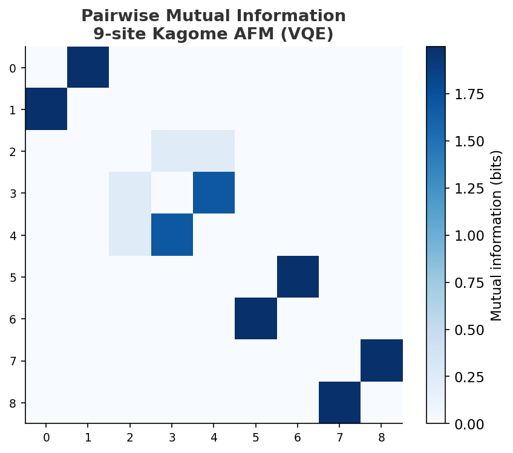
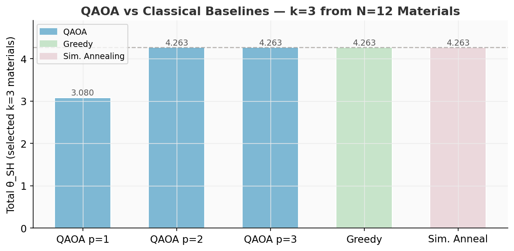
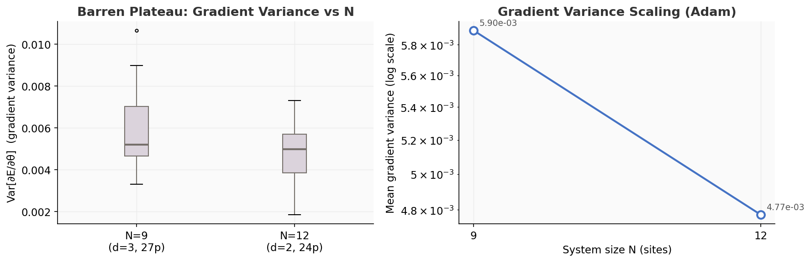

# Notebook Guide

> [← index](README.md)

---

## Prerequisites

```bash
python -m venv .venv
.venv\Scripts\activate        # Windows
source .venv/bin/activate     # Linux / macOS
pip install -e ".[dev]"
jupyter lab
```

All notebooks live in `notebooks/`. Run them in order — later notebooks depend on outputs from earlier ones.

---

## 01 — Kagome Hamiltonian & Exact Diagonalization

**File:** [`01_kagome_hamiltonian.ipynb`](../notebooks/01_kagome_hamiltonian.ipynb)  
**Status:** ✅ Complete

**What it does:**
- Builds the 9-site and 18-site Kagome lattice graphs
- Constructs the Heisenberg + anisotropy Hamiltonian as a PennyLane `Hamiltonian`
- Plots the lattice with sublattice coloring and Hamiltonian coefficient distribution
- Runs sparse exact diagonalization, extracts ground state energy and spectral gap
- Saves `data/ed_reference_energies.csv` (used by NB02)

**Key outputs:**
- `figures/kagome_lattice.png`
- `figures/hamiltonian_coeffs.png`
- `figures/ed_spectrum.png`
- `data/ed_reference_energies.csv`

**Validated results:**

| N | E₀ (normalized) | Gap Δ |
|---|-----------------|-------|
| 9 | −1.42190399 | ≈ 0 (degenerate) |
| 18 | −1.49962859 | 0.037 |


---

## 02 — VQE Ground State

**File:** [`02_vqe_run.ipynb`](../notebooks/02_vqe_run.ipynb)  
**Status:** ✅ Complete

**What it does:**
- **COBYLA** (primary): 5 seeds × 5000 evaluations, HEA depth=3, random init `scale=1.0`
- **Adam** (diagnostic): 2 seeds × 1000 steps — demonstrates the zero-gradient failure
- Plots COBYLA convergence curves + Adam gradient variance (barren plateau evidence)
- Saves best statevector to `data/statevector_hea_best.npy` for NB03

**Why COBYLA, not Adam:** `|0⟩⊗N` is a Z-basis eigenstate. All IsingXX/YY/ZZ gradients cancel
by SU(2) symmetry → Adam has nothing to follow. COBYLA samples the energy landscape
directly without needing gradients.

**Key outputs:**
- `figures/vqe_convergence.png`
- `figures/vqe_bar.png`
- `data/vqe_results.csv`
- `data/statevector_hea_best.npy`

**Results:**

| Method | E₀ | Error vs ED | Evals |
|--------|----|-------------|-------|
| COBYLA / HEA depth=3 | −1.28456 | **9.66%** | 801 |
| Adam / HEA depth=3 | +0.141 | stalled | 1000 |
| ED exact | −1.42190399 | — | — |


---

## 03 — Entanglement Analysis

**File:** [`03_entanglement.ipynb`](../notebooks/03_entanglement.ipynb)  
**Status:** ✅ Complete

**Depends on:** `data/statevector_hea_best.npy`

**What it does:**
- Single-site Von Neumann entropy for all 9 sites
- Bipartition scan: S vs subsystem size |A| = 1 → 4
- 9×9 pairwise mutual information matrix
- 3×3 sublattice mutual information matrix (A↔B, A↔C, B↔C)
- Spin liquid diagnostic interpretation

**Key outputs:**
- `figures/entanglement_bipartition.png`
- `figures/entanglement_mi_matrix.png`
- `figures/entanglement_sublattice_mi.png`

**Results:**

| Metric | Value | Interpretation |
|--------|-------|----------------|
| Mean single-site S | 0.9066 bits | Near-maximal → strong fluctuations |
| Max single-site S | 1.000 bits | 7/9 sites maximally entangled |
| Sublattice I(A:B) | 3.689 bits | Strong inter-sublattice correlations |
| Sublattice I(A:C/B:C) | 2.235 bits | Full 3-way entanglement |
| Mean pairwise MI | 0.227 bits | Long-range non-local correlations |

Site 2 shows anomalously low entropy (0.235 bits) consistent with specific frustrated geometry.
Sites 0 and 1 form a near-perfect Bell pair (singlet on that bond).

<table>
<tr>
<td></td>
<td></td>
</tr>
</table>

---

## 04 — SOC QAOA

**File:** [`04_soc_qaoa.ipynb`](../notebooks/04_soc_qaoa.ipynb)  
**Status:** ✅ Complete

**What it does:**
- Loads mock θ_SH dataset (12 spintronic materials, offline, no API key needed)
- Trains MLP surrogate (`surrogate.train_surrogate`)
- Scatter plot: actual vs predicted θ_SH
- Formulates k=3 from N=12 selection as QUBO with constraint penalty λ=6
- Runs QAOA at depth p=1, 2, 3 (COBYLA, 5 seeds × 300 evals per depth)
- Classical baselines: greedy top-k and simulated annealing
- Bar comparison and material ranking visualisation

**Key outputs:**
- `figures/surrogate_predictions.png`
- `figures/qaoa_comparison.png`
- `figures/qaoa_convergence.png`
- `figures/qaoa_material_ranking.png`
- `data/qaoa_results.csv`

**Results (k=3 from N=12 materials):**

| Method | Total θ_SH | Selected |
|--------|-----------|----------|
| QAOA p=1 | 3.080 | W, Ta, Bi₂Se₃ (sub-optimal) |
| **QAOA p=2** | **4.263** | **Mn₃Sn, CrTe₂, Bi₂Se₃** |
| QAOA p=3 | 4.263 | Mn₃Sn, CrTe₂, Bi₂Se₃ |
| Greedy | 4.263 | Bi₂Se₃, CrTe₂, Mn₃Sn |

QAOA p≥2 recovers the global optimum, matching greedy exactly.
p=1 (single layer) is insufficient for 12 qubits — as expected for shallow QAOA.

<table>
<tr>
<td></td>
<td></td>
</tr>
</table>

---

## 05 — Scaling Analysis

**File:** [`05_scaling_analysis.ipynb`](../notebooks/05_scaling_analysis.ipynb)  
**Status:** ✅ Complete

**What it does:**
- Sparse ED for N=12 inline (4096-dim Hilbert space, ~seconds)
- Loads N=9 COBYLA result from NB02 CSV (no rerun)
- Runs COBYLA VQE at N=12 (HEA depth=2, 24 params, 3 seeds × 2000 evals)
- VQE energy error vs N (9, 12) + ED reference at N=18
- Adam gradient variance at N=9 and N=12 (10 seeds × 30 steps)
- Box plot + log-scale plot of barren plateau scaling
- Saves `data/vqe_scaling.csv`

**Key outputs:**
- `figures/scaling_energy.png`
- `figures/scaling_gradient_variance.png`
- `data/vqe_scaling.csv`

<table>
<tr>
<td></td>
<td></td>
</tr>
</table>

---

## Running a specific notebook

```bash
# Execute in-place (saves outputs to the .ipynb file)
.venv\Scripts\python.exe -m jupyter nbconvert \
  --to notebook --execute --inplace \
  --ExecutePreprocessor.kernel_name=spinq-vqe \
  notebooks/01_kagome_hamiltonian.ipynb
```

Or open JupyterLab and run interactively.
