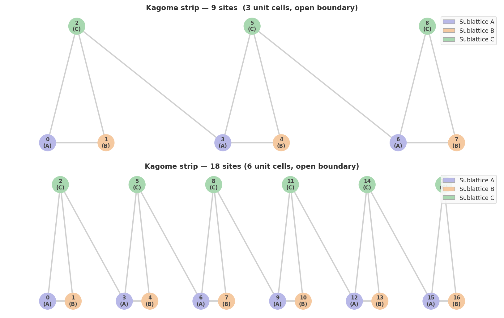
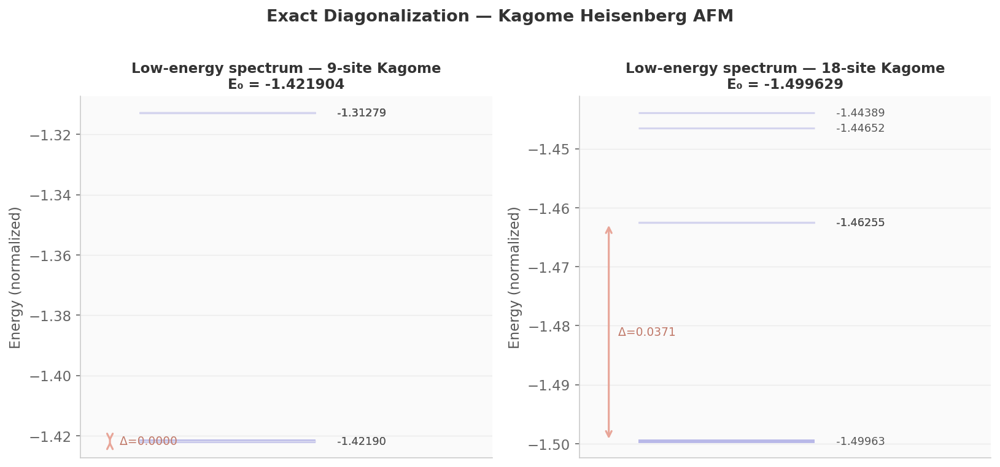

# Physics Background

> [← index](README.md)

---

## The experimental trigger

In May 2026, the Nakatsuji Lab at the University of Tokyo demonstrated **40-picosecond spin-orbit torque (SOT) switching** in Mn₃Sn / tantalum heterostructures. Mn₃Sn is a **Kagome antiferromagnet** — its unusual magnetic order and anomalous Hall response emerge directly from the geometry of its lattice.

We cannot fabricate this material. We *can* simulate its quantum many-body ground state using VQE and compare to published inelastic neutron scattering and magneto-transport data.

---

## The Kagome lattice

The Kagome lattice is a 2D network of **corner-sharing triangles** with three magnetic sublattices (A, B, C):

Each triangle has three spins. The antiferromagnetic exchange wants adjacent spins to be antiparallel — but a triangle cannot be simultaneously antiferromagnetic on all three bonds. This is **geometric frustration**.

**Consequence:** No classical Néel ground state exists. Quantum fluctuations dominate. The ground state is a **quantum spin liquid** — highly entangled, no long-range magnetic order.

For Mn₃Sn specifically, the three sublattice spins form a **120° non-coplanar order** that drives the anomalous Hall effect via Berry phase physics.

---

## The Hamiltonian

We implement the **S=½ Heisenberg antiferromagnet** with single-ion anisotropy:

$$H = J \sum_{\langle i,j \rangle} \mathbf{S}_i \cdot \mathbf{S}_j + D \sum_i (S_i^z)^2 + B \sum_i S_i^z$$

Using $\mathbf{S}_i \cdot \mathbf{S}_j = \frac{1}{4}(\sigma_i^x \sigma_j^x + \sigma_i^y \sigma_j^y + \sigma_i^z \sigma_j^z)$ for spin-½:

| Parameter | Value | Physical meaning |
|-----------|-------|-----------------|
| $J$ | 4.0 meV | Antiferromagnetic exchange (Nakatsuji 2022) |
| $D$ | 0.3 meV | Single-ion anisotropy |
| $B$ | 0.0 | External field (off by default) |

Coefficients are normalized by $N_{\text{sites}}$ for size-independent comparison across lattice sizes.

**Note on the D term:** For spin-½, $(S^z)^2 = \frac{1}{4}\mathbb{I}$ — a constant. The $D$ term contributes only a uniform energy shift and does not affect eigenstates or optimization. It is included for physical completeness and generality.

---

## Geometry implemented

The code builds a **1D Kagome strip** — a linear chain of corner-sharing triangles. This is a known approximation used in computational studies; it retains the frustration physics while being easier to scale.

| `n_cells` | Sites | Bonds |
|-----------|-------|-------|
| 1 | 3 | 3 |
| 3 | 9 | 11 |
| 6 | 18 | 23 |

**2D periodic Kagome tiling** (the true Mn₃Sn geometry) is planned for a future version once the 1D strip results are published.

---

## Exact diagonalization reference

We compute the ground state energy via sparse matrix diagonalization (`scipy.sparse.linalg.eigsh`) as a benchmark target for VQE.

| $N$ | $E_0$ (normalized) | Spectral gap $\Delta$ |
|-----|-------------------|----------------------|
| 9   | −1.42190399 | ≈ 0 (near-degenerate) |
| 18  | −1.49962859 | 0.037 |

The near-zero gap at $N=9$ reflects the quantum spin liquid physics — the ground state manifold is highly degenerate in the thermodynamic limit.

---

## Key references

- Sachdev (1992) PRB 45, 12377 — Kagome Heisenberg AFM theory
- Yan, Huse, White (2011) Science 332, 1173 — spin liquid ground state
- Nakatsuji & Ishizuka (2022) Ann. Phys. — Mn₃Sn physics review
- Nakatsuji et al. (2026) Science — 40 ps SOT switching

Full bibliography: [`REFERENCES.md`](../REFERENCES.md)
